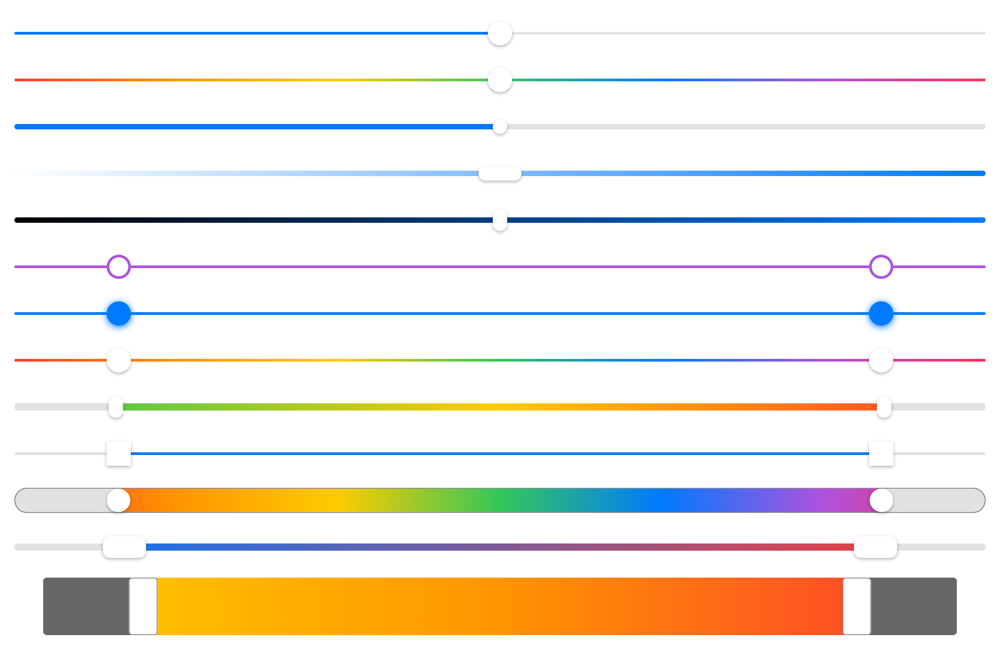

## SwiftUI Sliders

SwiftUI Sliders with custom styles for iOS, macOS and Mac Catalyst

<center>

</center>

## How to use

Add this swift package to  your project
```
git@github.com:spacenation/sliders.git
```

Import and use

```swift
import Sliders
import SwiftUI

struct ContentView: View {
    @State var value = 0.5
    @State var range = 0.2...0.8
    
    var body: some View {
        Group {
            ValueSlider(value: $value)
            RangeSlider(range: $range)
        }
    }
}
```
For more examples open `/Examples/SlidersExamples.xcodeproj`

## Fully customizable
```swift
RangeSlider(range: $range)
    .height(60)
    .thickness(8)
    /// Knob
    .knobSize(CGSize(width: 16, height: 24))
    .knobColor(.red)
    .knobCornerRadius(8)
    .knobBorderColor(.white)
    .knobBorderWidth(1)
    .knobShadowColor(.black)
    .knobShadowRadius(3)
    .knobShadowX(1)
    .knobShadowY(0)
    /// Value
    .valueColor(.blue)
    .clippedValue(false)
    /// Track
    .trackColor(.black)
    .trackCornerRadius(2)
    .trackBorderColor(.yellow)
    .trackBorderWidth(1)
    /// Style
    .sliderStyle(
        GradientSliderStyle()
    )
```

## Styles
### GradientSliderStyle
```swift
ValueSlider(value: $value)
    .clippedValue(false)
    .sliderStyle(
        GradientSliderStyle()
    )
```
```swift
RangeSlider(range: $range)
    .thickness(6)
    .sliderStyle(
        GradientSliderStyle(colors: [.green, .yellow, .red])
    )
```

### Create your own app-wide style with SliderStyle protocol
```swift
public protocol SliderStyle {
    var height: CGFloat { get set }
    var thickness: CGFloat { get set }
    
    var knobSize: CGSize { get set }
    var knobColor: Color { get set }
    var knobCornerRadius: CGFloat { get set }
    var knobBorderColor: Color { get set }
    var knobBorderWidth: CGFloat { get set }
    var knobShadowColor: Color { get set }
    var knobShadowRadius: CGFloat { get set }
    var knobShadowX: CGFloat { get set }
    var knobShadowY: CGFloat { get set }
    
    var valueColor: Color { get set }
    
    var trackColor: Color { get set }
    var trackCornerRadius: CGFloat? { get set }
    var trackBorderColor: Color { get set }
    var trackBorderWidth: CGFloat { get set }
        
    var clippedValue: Bool { get set }
    
    var knobView: AnyView { get }
    var valueView: AnyView { get }
    var trackView: AnyView { get }
}
```


## SDKs
- iOS 13+
- Mac Catalyst 13.0+
- macOS 10.15+
- Xcode 11.0+

## Version 1.0.0
Stable version will be released as soon as XCode 11 GM becomes available. We will strictly follow semantic versioning moving forward.

## Contibutions
Feel free to contribute via fork/pull request to master branch. If you want to request a feature or report a bug please start a new issue.
